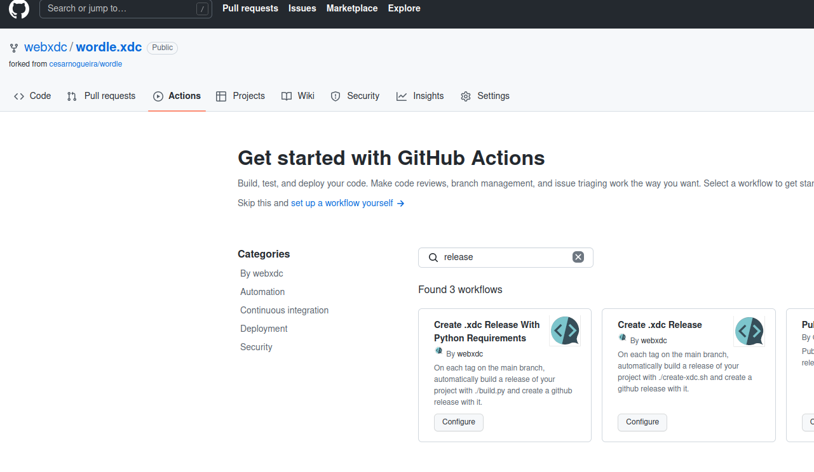

# webxdc GitHub Actions Templates

Thanks for contributing to [webxdc](https://github.com/webxdc)! Maybe these
GitHub Actions make your life a bit easier:

- [release.yml](workflow-templates/release.yml) runs
  [`create-xdc.sh`](https://github.com/webxdc/webxdc-dev/blob/master/create-xdc.sh)
  on every tag of your repository, to build a `.xdc` file and add it as a
  release to your repository.
- [release-python.yml](workflow-templates/release-python.yml) does the same,
  but with your personal python build script (`build.py` by default). 

## How to Integrate the GitHub Action to Your Repository

Adding a Release Action is as easy as 3 clicks:

1. Click on the "Actions" tab in your repository
  - (if you already have other GitHub Actions, you explicitly need to click on
    "New Workflow" here)
2. Scroll down to "By webxdc", click on the GitHub Action you want to include,
   e.g. "Create .xdc Release"
3. Click on "Start commit" to commit it to your `main` branch

Now you only need to create a tag on the `main` branch and a release is
created.

## Further Notes

Both GitHub Actions create a GitHub Release on a git tag. Its description will
be the commit message of the tagged commit. So it makes sense to make that
commit message a bit beautiful, with nice markdown, emojis, and whatever else
you need.

The example script for
[`release-python.yml`](workflow-templates/release-python.yml) was [the draw.xdc
build script](https://github.com/webxdc/draw.xdc/blob/main/build.py). If you
use a different python build script, you may need to adjust the github action
before you commit it to your repository.

